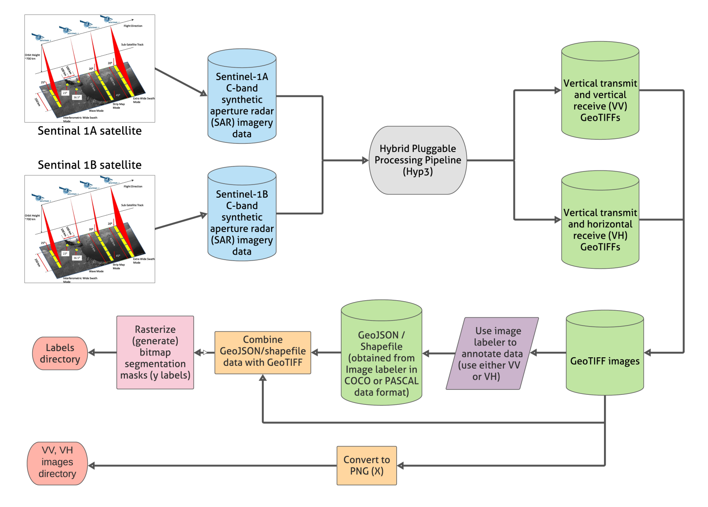

# QA-QC-doc

As a Research Scientist at NASA IMPACT, I spearheaded a project involving the QA/QC of flood extent data, leveraging Python and databases to ensure the accuracy and reliability of the dataset used for machine learning applications. The dataset, named "NASA Flood Extent Detection Dataset," comprised synthetic aperture radar (SAR) imagery from Sentinel-1A and Sentinel-1B missions, focusing on flood events in the United States and Bangladesh.

Challenges Faced:
The primary challenges in this project revolved around ensuring the precision of flood extent labels in the dataset. SAR imagery interpretation presented complexities, as distinguishing between open water and other dark features was intricate. Additionally, the project required collaboration with flood domain experts to validate and refine the labels, adding another layer of complexity to the QA/QC process.

## Data pre-processing & generation workflow

Approach to Problem-Solving:

1. **Collaboration with Domain Experts:** To address the intricacies of SAR imagery interpretation, collaboration with flood domain experts was initiated. These experts reviewed the data before it reached the labeling stage, providing valuable insights into the nuances of flood extent identification.

2. **Development of QA/QC Scripts in Python:** Python, with libraries such as [Hyp3](https://hyp3-docs.asf.alaska.edu/), NumPy, Pandas, and Matplotlib, played a pivotal role in developing scripts for QA/QC. These [scripts](scripts) generated data and performed data preprocessing and cleaning, analyses on the labeled data, identifying discrepancies and outliers that required manual verification. A basic [checklist](https://data.source.coop/nasa/floods/documentation.pdf) was also developed to ensure that the data met the project's quality standards.

3. **Integration of Databases for Data Validation:** A database, using AWS S3 bucket, was employed to store and manage labeled data. This facilitated efficient querying and comparison of labeled data, aiding in the identification of inconsistencies or errors.

4. **Expert Review and Iterative Refinement:** The flood extent labels were subject to expert review, ensuring that areas labeled as open water were accurate and reliable. This iterative process involved refining the labels based on discussions with analysts and project team members.

Outcomes Achieved:

1. **High-Quality Dataset:** The QA/QC process, combining Python scripts and expert reviews, led to the creation of a high-quality flood extent dataset. The dataset became a valuable resource for machine learning applications, contributing to the development of accurate flood detection models.

2. **Publication and Documentation:** The project outcomes, including the dataset and the QA/QC methodology, were documented in the publication titled [Curating flood extent data and leveraging citizen science for benchmarking machine learning solutions](https://d197for5662m48.cloudfront.net/documents/publicationstatus/107994/preprint_pdf/478225051219b1604a524ebca6a7533e.pdf). This documentation provided transparency and insights into the dataset's creation and validation process.

3. **Community Contribution:** By leveraging citizen science and artificial intelligence, the project contributed to the broader scientific community's understanding of flood extent data. The dataset was made publicly available through [Radiant MLHub](https://beta.source.coop/nasa/floods/), fostering collaboration and further research in the field.

In conclusion, this project showcased the effective use of Python and databases such as S3 bucket, in ensuring the quality of flood extent data. The collaborative approach, combining domain expertise with automated QA/QC processes, resulted in a reliable dataset with implications for advancing machine learning applications in flood detection and monitoring.

**References:**

1. [Curating flood extent data and leveraging citizen science for benchmarking machine learning solutions](https://doi.org/10.1002/essoar.10511103.1)
2. [Dataset Documentation](https://data.source.coop/nasa/floods/documentation.pdf)
3. [Flood Extent Data for Machine Learning](https://beta.source.coop/nasa/floods/)
